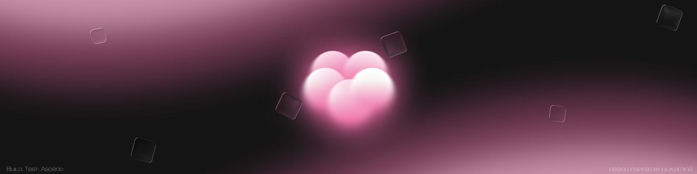

  

<h1 align="center">Hi, I'm John Lawrence Regis 👋</h1>

  <b>Aspiring QA Engineeer | Full-Stack Developer</b>

  <i>"Building software and testing it like it ships to production."</i>

  
  
  

---

## 👨‍💻 About Me

* 🎓 **Education:** BSIT Graduate
* 🔍 **Primary Focus:** QA Automation & Full-Stack Development
* ⚡ **Current Rig:** Building Playwright testing workflows integrated with GitHub Actions CI/CD
* 🚀 **Passion:** Creating resilient applications and validating them through automated testing pipelines

---

## 🛠️ Tech Stack

**Frontend**

  

**Backend**

  

**Testing & Tools**

  

---

## 🚀 Featured Projects

### 🧪 TaskFlow QA
*Full-stack task management application with end-to-end test automation.*

* **Tech Stack:** React, Laravel, MySQL, Playwright
* **Testing Highlights:**
  * Page Object Model (POM) Architecture
  * Automated GitHub Actions CI Pipeline
  * HTML Test Reports, Screenshots, Video Recording & Trace Viewer Integration
* 🔗 **Repository:** [`taskflow-qa`](https://github.com/ElReyDeLosGorditos/taskflow-qa)

---

### 🎮 Project Aether
*Phaser-based RPG prototype exploring interactive game mechanics and combat systems.*

---

### 🔧 CircuitHub
*Automated equipment borrowing platform built with React, Firebase, and Spring Boot.*

---

## 🎯 Current Focus

* **Playwright** E2E Automation
* **Laravel** RESTful APIs & Backend Architecture
* **GitHub Actions** CI/CD Pipelines & Continuous Testing Workflows

---

## 📊 GitHub Analytics

  
  

 

  <blockquote>
    <i>"Good software isn't just built — it's verified."</i>
  </blockquote>

